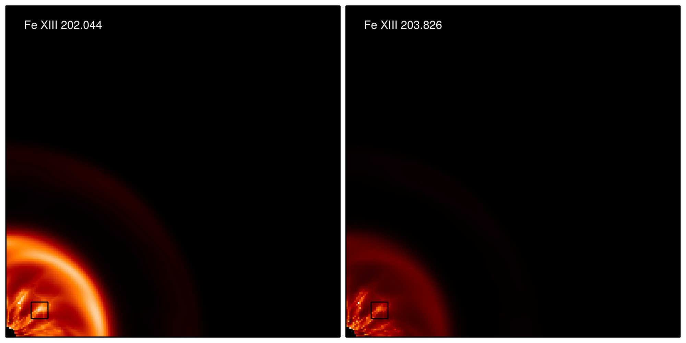
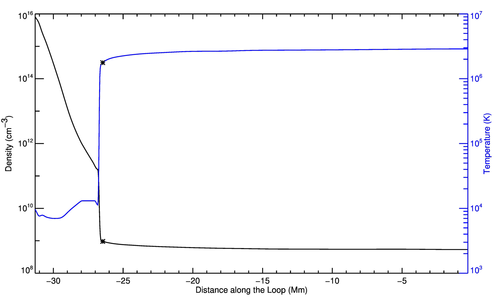

#### ISSIAtomicData/phase2_20161006/03_MHD

* mhd2ints: Reads in a PLUTO snapshot, computes Fe XIII intensities for each slice in z, sums the
  results.  A small region is selected and the peak and mean intensities are determined. Some
  nuances

    - The emissivities computed 01_chianti_errors need some 'extra' factors (e.g., elemental
      abundance, ionization fraction) to be useful for comparison with observations in absolute
      units. They are added in here.

* FIT_TEST_INTENSITIES_FE_13: This routine finds the best-fit density and path length for a given
  set of fake intensities. 