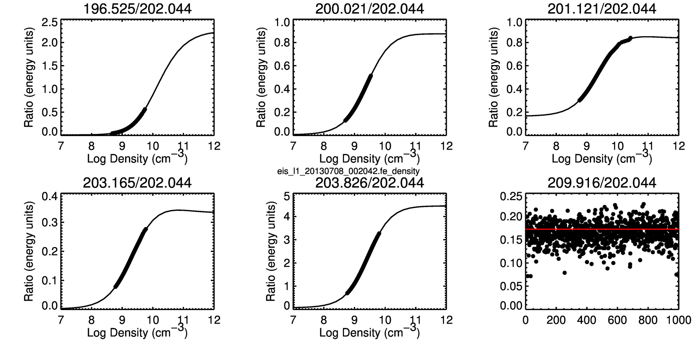
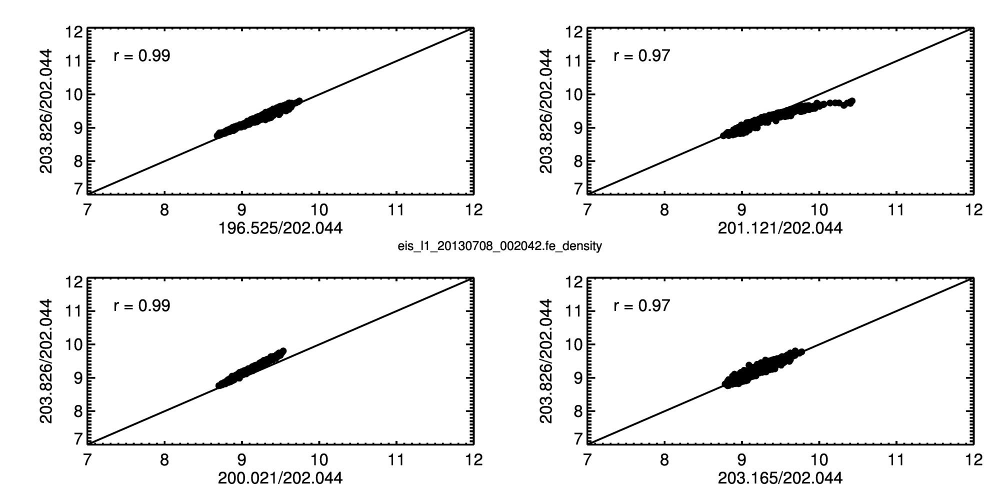

#### ISSIAtomicData/phase2_20161006/04_observed

Here we collect sets of observed intensities from an EIS observation of an active region
(eis_l1_20130708_002042). Intensities for the the following Fe XIII lines are saved: 196.525,   200.021, 201.121, 202.044, 203.165, 203.826, 209.916.

* fe_13_density.pro: This routine reads and organizes the intensities. Some nuances:

    + 1000 sets of intensities and the corresponding uncertainties are saved.

    + The intensities are stored in ascending order of wavelength.

    + The index variable saves the position of the intensities in the original raster. Additional   information is contained in the file fe_13_density.txt


    + The default atomic data is used to compute densities from each of the density sensitive line ratios. The 209.916/202.044 is not sensitive to density so the observed and theoretical ratio for each observation is plotted.

    
    

    + The data are saved with the following call. Note that the emssivities are also saved in this file for completeness.

```
  nrl_save_hdf, intensities=intensities_out, intensities_error=intensities_error_out, $
                index=index_out, eis_files=files, eis_nx=fit.nx, eis_ny=fit.ny, $
                n_intensities = n_intensities, n_lines=nfiles, ints_204_min=ints_204_min, $
                logn=logn, emissivity=emissivity, wavelength=wavelength, $
                time_stamp=time_stamp, $
                file=opf+'.h5'
```


* fe_13_fit_intensities.pro: This routine takes a single set of intensities and find the best-fit density and path length. For example,

```
 model log_n = 9.46 +- 0.008
model log_ds = 9.18 +- 0.018
        chi2 = 151.1
     Line    Imodel      Iobs    SigmaI  dI/Sigma      dI/I
  196.525   1330.44   1317.34     17.81      0.74       1.0
  200.021   2033.62   1809.67     32.90      6.81      12.4
  201.121   2493.90   2946.72     51.14      8.85      15.4
  202.044   4352.80   4153.84     64.85      3.07       4.8
  203.165    922.90   1028.12     52.13      2.02      10.2
  203.826  10058.87  10620.57    160.95      3.49       5.3
  209.916    751.71    722.57     74.38      0.39       4.0
```

Here is the result of using each of the 1000 realizations of CHIANTI to fit the single set of observations. 

  
