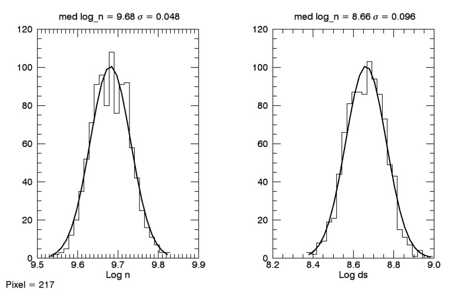

#### ISSIAtomicData/phase2_20161006/04_observed/loop

Here we loop over all of the sets of intensities and all of the realizaitons of CHIANTI atomic
data. Simply run `fe_13_fit_intensities_loop.pro`, which does the same calculation as
`fe_13_fit_intensities.pro` but in a loop. Slow, takes 2708.5s. Outputs for each pixel:
  
  + eis_l1_20130708_002042.fe_density.hist.0217.txt: The output for intensity set (pixel) 217 for
    all realizations of CHIANTI. n = 0 is the CHIANTI default. For example,
	
```
       n chianti = 0 <-- CHIANTI default
         n pixel = 217 <--- From the paper (n=1 is the first pixel)
     model log_n = 9.68 +- 0.010 <-- This is the log_n error from least-squares 
    model log_ds = 8.67 +- 0.021 <-- This is the log_ds error from least-squares
            chi2 = 154.5
 normalized chi2 = 30.9
      Line      Iobs    SigmaI    Imodel      dI/I  dI/Sigma
   196.525    1473.1      18.8    1473.8       0.0       0.0
   200.021    1521.4      29.1    1749.9      15.0       7.9
   201.121    2373.2      44.4    1987.0      16.3       8.7
   202.044    2866.5      53.6    2989.1       4.3       2.3
   203.165     775.2      42.5     767.5       1.0       0.2
   203.826    9237.6     142.6    8751.2       5.3       3.4
   209.916     530.2      56.4     516.2       2.6       0.2
```
	
  + eis_l1_20130708_002042.fe_density.hist.0217.jpg: A plot of the density and path length
    histograms. For example:
	
    
	
  + eis_l1_20130708_002042.fe_density.hist.0217.h5: The actual histograms and other relevant data
  
```
   dataset    /fit_log_ds <-- Gaussian fit parameters for log_ds distribution
   dataset    /fit_log_n <-- Gaussian fit parameters for log_n distribution
   dataset    /fits <-- Array of all fit parameters
   dataset    /hist_log_ds <-- Histogram of log_ds distribution
   dataset    /hist_log_n <-- Histogram of log_n distribution
   dataset    /med_log_ds <-- Median log_ds
   dataset    /med_log_n <-- Median log_n
   dataset    /std_log_ds <-- Standard deviation of log_ds
   dataset    /std_log_n <-- Standard deviation of log_n
   dataset    /xhist_log_ds <-- Locations for log_ds histogram
   dataset    /xhist_log_n <-- Locations for log_n histogram
```
